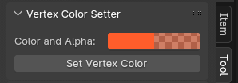

# Vertex Alpha Setter

Simple Addon for Blender, for setting your vertex colors in specific tones (with alpha)

## Installation

```
Install like any addon, -> Preferences -> Addons -> Install
(You only need the .py)
```

## Usage

```
1.Travel to the Viewport

2.Select the vertices you want to change

3.Select the Tool, Toolbar

4.Select color

5.Press "Set Vertex Color"

Profit
```


## Notes

Remember that you need to set up a shader beforehand to visualize the alpha channel in blender, it's commonly used the Color Attribute Node
